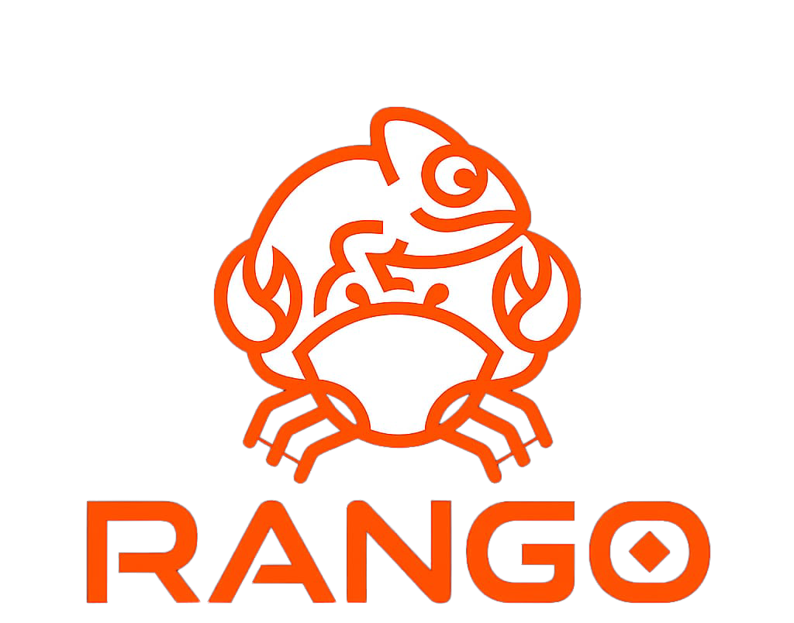

<p align="center">
    
</p>

> Django's productivity, Rust's performance and safety.

Rango is a lightweight, ergonomic web framework built on top of Axum. It is carefully designed to provide a productive, Django-like development experience in Rust, eliminating boilerplate while maintaining bare-metal performance.

📖 **[Full documentation is in `docs/`](docs/README.md)** — routing, templates, the ORM, the admin panel, forms, auth, messages/caching, middleware, signals, configuration, and the CLI.

---

## Key Features

- **Django-Inspired Routing ️**: Centralize your URLs in a single, clean file using the `urls!` macro. Support for nested sub-routers via `include` and `path`.
- **Simplified View Handling ️**: Write clean, asynchronous handlers using `#[view]` attributes. Let Rango manage the underlying Axum routing plumbing.
- **Feature-Rich, Easy ORM ️**: A Django-like `QuerySet` with safely-parameterized typed filters (`filter_eq`, `filter_icontains`, `filter_in`, ...), aggregates (`sum`, `avg`, `min_of`, `max_of`), pagination, `get_or_create`/`update_or_create`, bulk operations, and multi-database support (SQLite/PostgreSQL/MySQL) via a single `Any`-backed pool — completely optional and feature-gated.
- **Auto-Generated Admin Panel 🛠️**: Register a model and get a themed CRUD UI with search, pagination, and bulk delete for free.
- **Django-style Extras**: Flash messages (`rango::messages`), an in-memory cache (`rango::cache`), signals (`PRE_SAVE`/`POST_SAVE`/...), a `Form`/`Validator` toolkit, and Django-flavored template filters (`pluralize`, `intcomma`, `truncatewords`, `yesno`, ...).
- **Ergonomic Contexts**: Create view contexts instantly with the `context!` macro for seamless JSON payloads and template rendering.
- **Blazing Fast Compilation 🚀**: Highly modular design. If you don't use the database or templates, they aren't compiled. Keep your binary lightweight.

📖 See the [full documentation](docs/README.md) for details on every feature above.

---

## ️ Project Structure

```text
rango_workspace/
├── rango/           # Core framework library (State, Middleware, Responses)
├── macros/          # Procedural macros (view, urls, context)
├── cli/       # CLI tool for scaffolding projects and apps
└── docs/            # Documentation assets
```

---

### Install the CLI

To use the `rango` command-line tool for scaffolding:

```bash
cargo install rango-cli
```

---

## Quick Start

1. **Create a new project:**

   ```bash
   rango startproject my_cool_site
   cd my_cool_site
   ```

2. **Run the development server:**
   ```bash
   rango runserver
   ```

---

## Usage Guide

### Centralized Routing

Define your application's URL structure in `src/urls.rs`. Rango supports nesting routes just like Django's `include`.

```rust
use rango::macros::{urls, view};
use crate::{blog, api};

urls!(
    path("/", home_view),
    include("/blog", blog::urls::get_rango_router),
    include("/api", api::urls::get_rango_router),
);

#[view]
pub async fn home_view() {
    rango::render("index.html", rango::json!({
        "title": "Welcome to Rango"
    })).unwrap()
}
```

### Writing Views

Use the `#[view]` macro to turn async functions into valid Rango/Axum handlers. You can use standard Axum extractors like `Path`, `Query`, and `Json`.

```rust
use rango::macros::view;
use rango::responses::json_response;
use rango::{Path, Json};

#[view(method = "POST")]
pub async fn create_post(Json(body): Json<serde_json::Value>) {
    json_response(rango::json!({
        "message": "Post created successfully",
        "data": body
    }))
}
```

### Template Rendering

Rango uses **MiniJinja** for high-performance template rendering. Use the `context!` macro to pass data to your templates easily.

```rust
use rango::macros::{view, context};
use rango::responses::render;

#[view]
pub async fn blog_index() {
    let posts = vec!["Post 1", "Post 2"];
    render("blog/index.html", context! {
        posts => posts,
        author => "Dera"
    }).unwrap()
}
```

### Configuration

Initialize Rango with a configuration struct in your `main.rs`:

```rust
use rango::state::{RangoConfig, init_config};

#[tokio::main]
async fn main() {
    init_config(RangoConfig {
        debug: true,
        templates_dir: "templates".to_string(),
        database_url: Some("sqlite://db.sqlite3".to_string()),
        ..Default::default()
    });

    let router = urls::get_rango_router();
    rango::start(router).run().await;
}
```

### Database Models & ORM

Rango comes with a built-in lightweight ORM. Just use the `#[model]` macro to automatically derive CRUD operations, database queries, and migration definitions!

```rust
use rango::macros::model;
use rango::RangoModel; // Provides trait methods like `all`, `save`, `get_by_id`, `delete`

#[model]
pub struct Todo {
    pub id: i64,
    pub title: String,
    pub completed: i64, // Using i64 for boolean fields guarantees cross-database compatibility
}

// Fetch all records
let todos = Todo::all().await.unwrap();

// Saving a new record
let mut new_todo = Todo {
    id: 0,
    title: "Write documentation".to_string(),
    completed: 0,
};
new_todo.save().await.unwrap();

// Fetch, update, and delete
let mut todo = Todo::get_by_id(1).await.unwrap().unwrap();
todo.completed = 1;
todo.save().await.unwrap();

todo.delete().await.unwrap();
```

### Auto-generated Admin Panel

When you use the `#[model]` macro and enable the `templates` and `db` features, Rango provides a Django-style admin panel out of the box to easily manage your data!

1. Create a `RangoAdmin` instance and register your models.
2. Mount the admin router to your application.

```rust
use rango::RangoAdmin;
use crate::models::Todo;

#[tokio::main]
async fn main() {
    // ... initialize your configuration ...

    // Register models in the Admin Panel
    let mut admin = RangoAdmin::new();
    admin.register::<Todo>();

    // Mount the admin router to /admin
    let router = urls::get_rango_router()
        .nest("/admin", admin.router());

    rango::start(router).run().await;
}
```

### Middleware

Rango supports standard Axum middleware and provides some built-in helpers.

```rust
use rango::middleware::require_auth;
use axum::middleware::from_fn;

// In your router configuration:
let router = urls::get_rango_router()
    .layer(from_fn(require_auth));
```

---

## ️ CLI Commands

- `rango startproject <name>`: Scaffolds a new Rango project structure.
- `rango startapp <name>`: Creates a new "app" module with `views.rs`, `urls.rs`, and a template folder.
- `rango runserver`: Starts the project using `cargo run` with environment defaults.

---

## Contributing

Contributions are welcome! Please read [CONTRIBUTING.md](CONTRIBUTING.md) for the development setup, coding guidelines, and PR workflow before opening a pull request.

## License

This project is licensed under the MIT License - see the [LICENSE](LICENSE) file for details.
